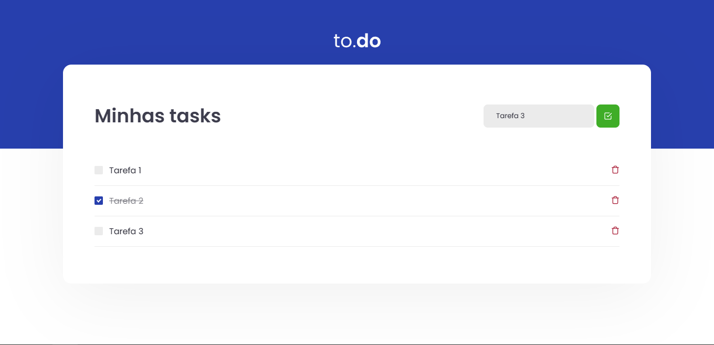

# :clipboard: Índice

- [Sobre](#sobre)
- [Instruções do Desafio](#desafio)
- [Como Executar o Projeto](#executar)
- [License](#license)

---

<a id="sobre"></a>

# :scroll: Sobre

 O <b>To.do</b> é uma aplicação Web desenvolvida para um desafio da trilha de 2021 do Ignite da Rocktseat.
<div align="center">
    
</div>

 ---

 <a id="desafio"></a>

# :rocket: Instruções do Desafio

O objetivo é uma pequena aplicação de atividades a fazer, para treinar um pouco sobre maniulação de estado no React.
- Adicionar uma nova tarefa
- Remover uma tarefa
- Marcar e desmacar uma tarefa como concluída
- Executar os testes de TaskList.spec.tsx com sucesso
 
 ---

 <a id="executar">

# :computer: Como Executar o projeto

```bash
    # Clonar o repositório
    git clone https://github.com/pereirathiago/ignite-desafio01-todo.git

    # Entrar no projeto
    cd ignite-desafio01-todo

    # Baixar as dependências
    yarn install

    # Executar o server
    yarn dev
```
Depois disso abra seu navegador favorito e entre na URL "http://localhost:8080"

---

<a id="license"><a>

## :memo: License

Esse projeto está sob a licença MIT. Veja o arquivo [LICENSE](LICENSE) para mais detalhes.

---

<p align="center">
    Feito com 💜 por Thiago Pereira
</p>
