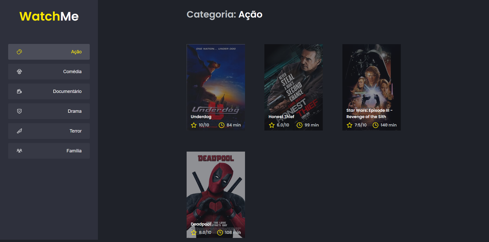

# :clipboard: Índice

- [Sobre](#sobre)
- [Instruções do Desafio](#desafio)
- [Como Executar o Projeto](#executar)
- [License](#license)

---

<a id="sobre"></a>

# :scroll: Sobre

 O <b>WatchMe</b> é uma aplicação Web desenvolvida para um desafio da trilha de 2021 do Ignite da Rocktseat, utilizando FakeAPI.
<div align="center">
    
</div>

 ---

 <a id="desafio"></a>

# :rocket: Instruções do Desafio

O objetivo é reorganizar o código da aplicação utilizando componentesPI.
- A aplicação possui apenas uma funcionalidade principal que é a listagem de filmes;
- Na sidebar é possível selecionar qual categoria de filmes deve ser listada;
- A primeira categoria da lista (que é "Ação") já deve começar como marcada;
- O header da aplicação possui apenas o nome da categoria selecionada que deve mudar dinamicamente.
 
 ---

 <a id="executar"></a>

# :computer: Como Executar o projeto

```bash
        # Clonar o repositório
    git clone https://github.com/pereirathiago/ignite-react-desafios-trilha-2021.git

    # Entrar no projeto
    cd ignite-react-desafios-trilha-2021

    # Entrar na pasta desse desafio
    cd 02-desafio-filmes-componentes

    # Baixar as dependências
    yarn install

    # Executar o server
    yarn server

    # Em outro terminal executar a aplicação
    yarn start
```
Depois disso abra seu navegador favorito e entre na URL "http://localhost:3000"

---

<a id="license"><a>

## :memo: License

Esse projeto está sob a licença MIT. Veja o arquivo [LICENSE](LICENSE) para mais detalhes.

---

<p align="center">
    Feito com 💜 por Thiago Pereira
</p>
